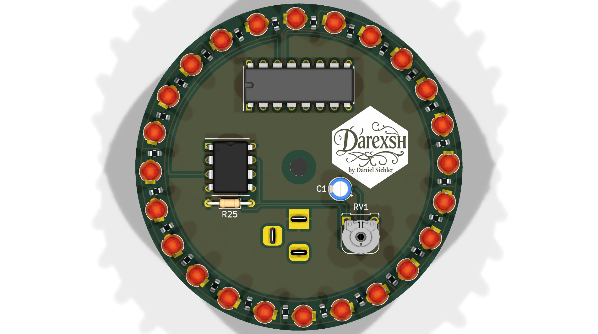
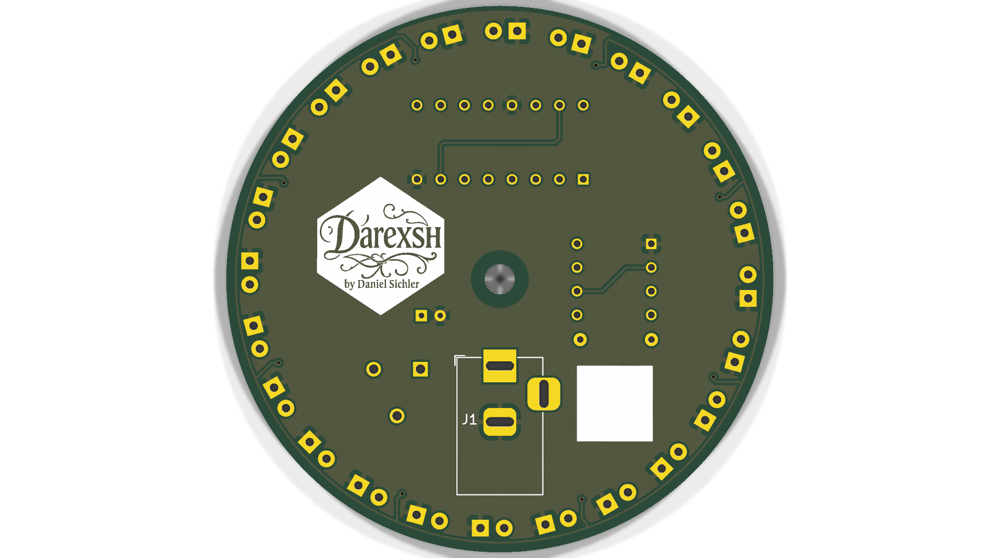

* * *

🌈 RGB Ringlight – LED Chaser
============================

**🟥🟩🟦 RGB LED Chaser using 3 mm LEDs**  

Powered by NE555, CD4017, and a speed control potentiometer

  

* * *

✨ Authors
---------

| Name | GitHub | Role | Contact | Contributions |
| --- | --- | --- | --- | --- |
| **[Daniel Sichler aka Darexsh](https://github.com/Darexsh)** | [Link](https://github.com/Darexsh?tab=repositories) | Hardware & Schematic 🖥️🛠️| 📧 [E-Mail](mailto:sichler.daniel@gmail.com) | Concept, Layout, Integration |

* * *

🚀 About the Project
--------------------

This project is an **RGB ring light with a chaser animation**, built entirely from discrete electronics.
The core consists of:
* **NE555:** Clock Generator
* **CD4017:** Decade Counter
* **24 LEDs:** Positioned in Circle shape with with alternatingly positioned red, green and blue LEDs
    
The **chase speed** can be adjusted using a **10 kΩ potentiometer**.
Power is supplied through a **9 V barrel jack (5.5 mm)**.
    

* * *

🛠️ How It Works
===========

🔁 **Main Function**
* The **NE555** operates in astable mode, generating a variable clock signal.
* The **CD4017** advances one output pin per clock pulse.
* Each LED lights up sequentially → creating the classic **LED chaser effect**.

💡 **LED Layout**

The ring contains **24 LEDs** total:
* 🔴 **D1–D8:** Red
* 🟢 **D9–D16:** Green
* 🔵 **D17–D24:** Blue

🎚️ **Speed Control**
* A **10 kΩ potentiometer (RV1)** adjusts the NE555 frequency.

🔌 **Power Supply**
* **9 V DC input**
* Supplied through a **5.5 mm barrel jack**

* * *

📋 Bill of Materials (BOM)
===========

| Part       | Value / Type                              |
| ---------- | ----------------------------------------- |
| **IC1**    | CD4017BE                                  |
| **IC2**    | NE555P                                    |
| **LEDs**   | 24× 3 mm LEDs (8× red, 8× green, 8× blue) |
| **R1–R24** | 680 Ω                                     |
| **R25**    | 10 kΩ                                     |
| **RV1**    | 10 kΩ potentiometer                       |
| **C1**     | 10 µF / 25 V                              |
| **J1**     | DC barrel jack 5.5 mm (with switch)       |
| **J2**     | Socket for CD4017                         |
| **J3**     | Socket for NE555                          |
| **H1**     | Mounting hole                             |

* * *

📜 License
----------

This project is licensed under the **Non-Commercial Software License (MIT-style) v1.0** and was developed as an educational project. You are free to use, modify, and distribute the code for **non-commercial purposes only**, and must credit the author:

**Copyright (c) 2025 Darexsh by Daniel Sichler**

Please include the following notice with any use or distribution:

> Developed by Daniel Sichler aka Darexsh. Licensed under the Non-Commercial Software License (MIT-style) v1.0. See `LICENSE` for details.

The full license is available in the [LICENSE](LICENSE) file.

* * *

<!-- Keep this line! Rendered picture of PCB is going to be displayed after Production files are pushed to branch! -->

 Created with ❤️ by Daniel Sichler 

